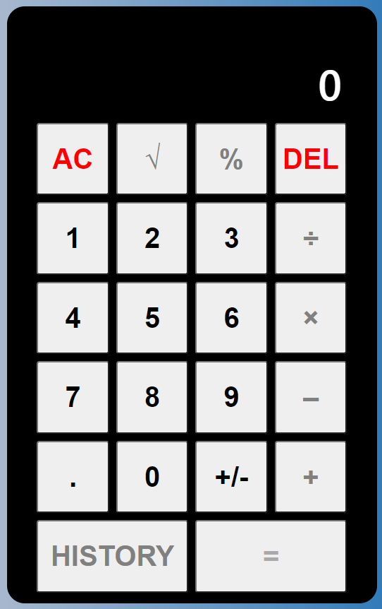

# The React Framework - Calculator solution

## Overview
This project focuses on building a calcultor that does basic arithmetic operations. This one functions like the first calculator project, which was build with classes and vanilla JavaScript.

### The Manual

Users of this Calculator should be able to:

- View the optimal layout for the component depending on their device's screen size
- view complete arithmetic expressions before result is eventually displayed
- Square root and Percentage functions have been included
- The HISTORY button will be made functional when project is made full stack! Keeping fingers crossed.

### Calculator Screenshot

### Links

- Solution URL: [Please click here!](https://kuckelvin.github.io/Calculator_R)

## Thanks for your time!

### Built with

- Semantic HTML5 markup
- CSS custom properties
- Flexbox
- CSS Grid
- Mobile-first workflow
- [React](https://reactjs.org/) - JS library
- [Styled Components]

### Author: Kelvin Echenim.

